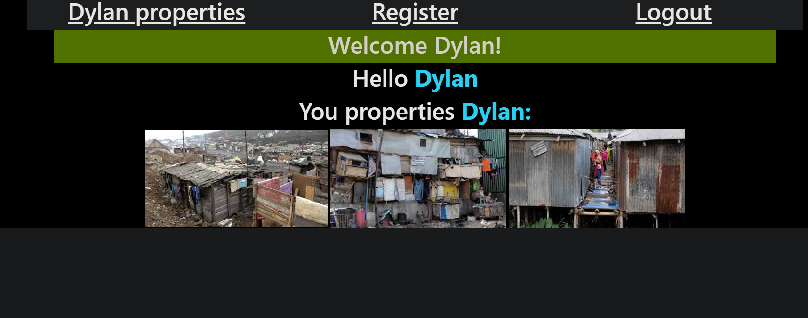

# Working with User Login

> This Project was about learning how to authenticate users flask SQLAlchemy

>BreakDown of flask-sql-alchemy:

> (Flask SQLAlchemy is a popular extension for Flask that provides an Object-Relational Mapping (ORM) layer for working with databases. It allows developers to easily define database models, interact with the database using Python objects, and perform complex database queries.)

> What was used in this project
* html
* flask
* bootstrap
* css
> preview 1

> preview 2

> preview 3

